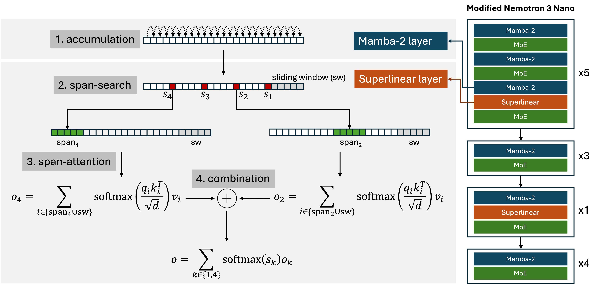

# Superlinear

**Long-context inference with efficient sparse attention**

[](LICENSE)
[](https://www.python.org/downloads/)
[](https://pytorch.org/)

Superlinear is an inference engine for long-context language models built on [Superlinear Multi-Step Attention](https://arxiv.org/abs/2601.18401) — a fully trainable multi-step attention architecture that achieves **subquadratic complexity** while preserving **random context access** (no eligible token position is structurally excluded from attention). It comes with an OpenAI-compatible server and a CLI that lets you chat, ingest documents, and manage sessions — with **explicit, stateful KV cache reuse across turns**. Unlike stateless “send the full prompt every turn” setups, Superlinear exposes sessions/snapshots so you can directly manage KV cache lifetime and GPU memory for performance.

> **⚠️ Research Preview — Not for Production Use**
>
> This software and its associated model weights are released as an **experimental research artifact** accompanying the [Superlinear Multi-Step Attention](https://arxiv.org/abs/2601.18401) paper. They are provided for research, experimentation, and exploration purposes only. The model has undergone **limited** training and evaluation (primarily NIAH retrieval); it has **not** been evaluated for safety, factual accuracy, or robustness across general tasks. **Do not use this system for any critical, production, or decision-making applications.** The authors and contributors assume no responsibility or liability for any outputs generated or consequences arising from the use of this software.

<p align="center">
  
</p>

<p align="center"><em>
Superlinear attention reformulates causal self-attention as a multi-step search problem with N steps,
yielding O(L<sup>1+1/N</sup>) complexity. In the baseline N=2 instantiation (analogous to jump search):<br>
(1) <b>accumulate</b> prefix context via linear recurrence (Mamba-2),
(2) <b>span-search</b> over O(√L) anchors to route to relevant regions,
(3) <b>span-attention</b> over the top-k selected spans, and
(4) <b>combine</b> via softmax-weighted gating —
achieving O(L<sup>3/2</sup>) complexity while preserving random context access.
</em></p>

## Installation

### Install the repo (kernels + CLI/server)

```bash
git clone https://github.com/concavity-ai/superlinear.git
cd superlinear

# Superlinear itself only depends on torch + triton.
pip install -e ".[server]"
```

**Requirements:** Python ≥ 3.9, PyTorch ≥ 2.0, Triton ≥ 2.1, CUDA-capable GPU.

### Run the released model (additional GPU deps)

To run **concavity-ai/superlinear-exp-v0.1**, you need additional model/runtime dependencies and CUDA-compiled extensions.

Copy/paste one-liner (recommended, from repo root):

```bash
conda env create -f environment.yml \
    && conda run -n superlinear pip install torch --index-url https://download.pytorch.org/whl/cu128 \
    && conda run -n superlinear pip install -e ".[server,model]" \
    && conda run -n superlinear bash -lc 'CUDA_HOME="$CONDA_PREFIX" pip install "mamba-ssm[causal-conv1d]" --no-build-isolation --no-cache-dir --no-binary :all:'
```

See [docs/installation.md](docs/installation.md) for step-by-step instructions, tested versions, and a pip-only option (if you already have `mamba-ssm[causal-conv1d]` working).

## Memory Management

Superlinear’s main differentiator is **stateful KV cache reuse**: you can keep long contexts “hot” across turns and actively control memory/performance via sessions, snapshots, and chunked prefill (`--chunk-size`).

- **GPU memory budgeting.** The model weights for **concavity-ai/superlinear-exp-v0.1** require ~60 GB VRAM at 16-bit precision. Additionally, the KV cache uses ~6 GB per million tokens of context. Budget extra headroom for chunked prefill working memory. A single 80 GB GPU can run up to ~2M context; 180 GB (e.g., B200) supports 10M+ context.

- **KV cache dominates at long context.** Rough rule of thumb: ~6 GB per 1M tokens *per active session*. If you keep multiple sessions open concurrently, KV cache usage scales roughly linearly with the number of sessions.
- **Chunked prefill trades throughput for peak VRAM.** Prefill runs in chunks to limit peak memory. The server default is `--chunk-size 8192`.
    - Larger chunks typically improve throughput (fewer chunk boundaries / overhead).
    - Smaller chunks reduce peak VRAM during prefill, which can help avoid OOM on smaller GPUs.
    - If you hit OOM during prefill, try reducing chunk size first:
        - `spl server start --model concavity-ai/superlinear-exp-v0.1 --chunk-size 4096`
        - (or increase it on large-memory GPUs for better throughput, e.g. `--chunk-size 32768`, as used in the paper’s throughput measurements)
- **Use sessions to avoid re-prefill.** Stateful sessions persist the KV cache across turns, so follow-up turns don’t require re-sending/re-prefilling the entire history.
- **Use snapshots to checkpoint and free GPU memory.** Snapshots save session/workspace state to disk so you can close sessions (freeing VRAM) and later resume from a snapshot without re-ingesting documents.

---

## Quick Start

### 1. Start the server

```bash
spl server start --model concavity-ai/superlinear-exp-v0.1
```

This downloads the model (if needed) and launches the inference server in the background (default: `http://127.0.0.1:8787`). Check status with `spl server status`.

### 2. Chat

```bash
spl chat
```

Opens an interactive REPL with persistent sessions and thinking mode. Type `/help` for all commands.

```
spl(chat:chat_20260206_...)> What is the capital of France?
thinking: The user is asking a simple factual question...
assistant: The capital of France is Paris.
```

### 3. Document Q&A

Load documents into a workspace, then ask questions with automatic RAG retrieval:

```bash
spl docs wiki
```

```
spl(docs:wiki:INGEST)> /add examples/docs/wiki -s
added files=8 bytes=... sources=8
saved base_snapshot_id=764cb17e...

spl(docs:wiki:INGEST)> How do RNNs and Transformers differ in handling sequences?
assistant: ...
```

Save your workspace as a snapshot and resume later:

```
# Later, resume from the snapshot:
$ spl docs wiki -l 764cb17e...
```

---

## CLI Reference

The `spl` command is the primary interface. All commands talk to the server over HTTP.

### Server Management

```bash
spl server start --model concavity-ai/superlinear-exp-v0.1   # Start server (background)
spl server start --model concavity-ai/superlinear-exp-v0.1 --foreground  # Start in foreground
spl server start --model concavity-ai/superlinear-exp-v0.1 --chunk-size 4096  # Reduce peak VRAM during prefill (default: 8192)
spl server status                 # Check if server is running
spl server stop                   # Stop server
spl server connect <url>          # Connect to a remote server
```

### Chat & Docs REPLs

```bash
spl chat                          # Interactive chat
spl chat --new                    # Start fresh session
spl docs <name>                   # Document Q&A workspace
spl docs <name> -l <snapshot_id>  # Resume from snapshot
```

Both REPLs support these commands (type `/help` inside):

| Command | Description |
|---------|-------------|
| `/help` | Show all commands |
| `/ls` | List sessions and snapshots |
| `/rm` | Delete current session, start fresh |
| `/rm <id...>` | Delete specific session(s) or snapshot(s) |
| `/save [title]` | Save session as snapshot |
| `/load <snap>` | Load snapshot |
| `/head [n]` / `/tail [n]` | Show first/last messages |
| `/history [n]` | Show input history |
| `/stats` | Show last turn metrics |
| `/info` | Show workspace info (docs only) |
| `/add <paths...>` | Add documents (docs only) |
| `/sources` | List loaded sources (docs only) |
| `/rag ...` | Configure RAG retrieval (docs only) |

### Session & Snapshot Management

```bash
spl ls                            # List all sessions and snapshots
spl rm <id...>                    # Remove session(s) or snapshot(s)
spl session ls                    # List sessions (detailed)
spl session info <id>             # Show session info
spl snapshot ls                   # List snapshots (detailed)
spl snapshot save --session <id>  # Save session as snapshot
spl snapshot load <snap_id>       # Load snapshot into new session
spl snapshot rm --all             # Delete all snapshots
```

---

## Using the Server API Directly

The server exposes an OpenAI-compatible API. Any OpenAI SDK client works out of the box:

```python
from openai import OpenAI

client = OpenAI(base_url="http://localhost:8787/v1", api_key="not-needed")

response = client.chat.completions.create(
    model="superlinear-exp-v0.1",
    messages=[{"role": "user", "content": "Hello!"}],
    max_tokens=100,
)
print(response.choices[0].message.content)
```

### Stateful Sessions

The key differentiator is **stateful sessions**. Instead of resending the full conversation (and re-prefilling it) each turn, the server maintains the KV cache across turns to make long-context interaction feel closer to an interactive “running process” than a stateless API call.

```python
import requests
from openai import OpenAI

BASE = "http://localhost:8787"
client = OpenAI(base_url=f"{BASE}/v1", api_key="not-needed")

# Create a session
requests.post(f"{BASE}/v1/sessions", json={"session_id": "my-chat"})

# Turn 1 — ingests and caches
client.chat.completions.create(
    model="superlinear-exp-v0.1",
    messages=[{"role": "user", "content": "My name is Alice."}],
    extra_body={"session_id": "my-chat"},
)

# Turn 2 — only the new message is processed; prior turns are cached
response = client.chat.completions.create(
    model="superlinear-exp-v0.1",
    messages=[{"role": "user", "content": "What's my name?"}],
    extra_body={"session_id": "my-chat"},
)
print(response.choices[0].message.content)  # "Alice"

# Cleanup
requests.delete(f"{BASE}/v1/sessions/my-chat")
```

### Snapshots

Snapshots save the full session state (KV cache + history) to disk. This lets you **resume conversations instantly** or **fork** a session into multiple branches without re-processing the context.

```python
# Save a snapshot
requests.post(f"{BASE}/v1/sessions/my-chat/save", json={"title": "checkpoint-1"})
# Returns: {"snapshot_id": "764cb17e..."}

# Load it back (into a new or existing session)
requests.post(f"{BASE}/v1/snapshots/764cb17e.../load", json={"session_id": "my-chat-v2"})
```

**Use cases:**
- **Document ingestion caching** — Ingest a large corpus once, snapshot it, and load the snapshot each time you want to ask new questions.
- **Conversation branching** — Snapshot at a decision point, then explore multiple conversation paths.
- **Warm starts** — Pre-build a session with a system prompt + reference material, snapshot it, and load it for every new user.

### Reasoning Mode

Enable chain-of-thought reasoning with a token budget:

```python
response = client.chat.completions.create(
    model="superlinear-exp-v0.1",
    messages=[{"role": "user", "content": "Solve: 15 × 17"}],
    extra_body={"reasoning_budget": 256},
)
```

### Repetition Detection

Automatically stop runaway generation loops:

```python
response = client.chat.completions.create(
    model="superlinear-exp-v0.1",
    messages=[{"role": "user", "content": "List all primes"}],
    max_tokens=50000,
    extra_body={
        "repetition_detection": {
            "enabled": True,
            "tail_len": 1024,
            "min_repeats": 3,
            "max_period": 512,
        }
    },
)
# finish_reason will be "repetition" if a loop was detected
```

### API Endpoints

| Endpoint | Method | Description |
|----------|--------|-------------|
| `/health` | GET | Health check |
| `/v1/models` | GET | List available models |
| `/v1/chat/completions` | POST | Chat completions (streaming supported) |
| `/v1/sessions` | POST | Create a stateful session |
| `/v1/sessions` | GET | List active sessions |
| `/v1/sessions/{id}` | GET | Get session info |
| `/v1/sessions/{id}` | DELETE | Close session |
| `/v1/sessions/{id}/history` | GET | Get conversation history |
| `/v1/sessions/{id}/resize` | POST | Resize session context length |
| `/v1/sessions/{id}/save` | POST | Save session as snapshot |
| `/v1/snapshots` | GET | List snapshots |
| `/v1/snapshots/{id}` | GET | Get snapshot info |
| `/v1/snapshots/{id}` | DELETE | Delete snapshot |
| `/v1/snapshots/{id}/load` | POST | Load snapshot into session |

---

## Sparse Attention Kernels

Under the hood, Superlinear uses custom Triton kernels implementing the [Superlinear Multi-Step Attention](https://arxiv.org/abs/2601.18401) architecture. The baseline N=2 mechanism works as follows:

1. **Span-search** — For each query at position *i*, score O(√i) candidate anchors (placed at a power-law stride pattern) using a routing query Q_s against accumulated keys K_a, then select the top-k anchors.
2. **Span-attention** — Attend to contiguous spans of O(√i) tokens centered at each selected anchor, plus a local sliding window for short-range context.
3. **Combination** — Merge span outputs via softmax-weighted gating over the search scores, making routing end-to-end trainable.

This yields O(L^{3/2}) total complexity for prefill/training while preserving **random context access**: the union of all candidate spans covers every eligible key position.

A **bucketed kernel design** groups (query, span) pairs by key-block footprint for efficient GPU tiling without global sorting. See [Section 4.3 of the paper](https://arxiv.org/abs/2601.18401) for details.

### Throughput

Measured on a single NVIDIA B200 GPU (180 GB VRAM), batch size 1, on a modified 30B hybrid MoE model ([nvidia/NVIDIA-Nemotron-3-Nano-30B-A3B-BF16](https://huggingface.co/nvidia/NVIDIA-Nemotron-3-Nano-30B-A3B-BF16)). Prefill uses 32K chunked prefilling.

| Context Length | Prefill (tok/s) | Decode (tok/s) | Decode Latency |
|----------------|-----------------|----------------|----------------|
| 1M tokens      | ~20,000         | ~109           | ~9.2 ms/tok    |
| 10M tokens     | ~5,500          | ~76            | ~13.2 ms/tok   |

FlashAttention-2 is faster at short contexts (<60K) but its throughput drops rapidly with length. Superlinear attention overtakes it near 60K tokens and scales into the multi-million-token regime where dense attention is impractical. See [Section 4.4 of the paper](https://arxiv.org/abs/2601.18401) for the full comparison.

### Key Features

- **Content-dependent routing** — Spans are selected by learned search scores, not fixed sparsity patterns.
- **Sliding window** — Recent tokens are always attended to via a local window.
- **GQA support** — First-class support for Grouped Query Attention.
- **CUDA graph compatible** — Optimized for high-throughput inference with graph capture.

### Parameters

| Parameter | Description |
|-----------|-------------|
| `sw_index` | Sliding window index. Window size = `(sw_index + 1)² - 1` |
| `num_spans` | Number of top-k spans to aggregate (typically 2–3) |
| `backward_factor` | Factor for backward span extension from anchor |
| `forward_factor` | Factor for forward span extension from anchor |
| `search_power` | Exponent *p* for anchor stride pattern; balanced at 0.5, upscaled to ~0.55 for robustness |
| `span_power` | Exponent for span length scaling; span length ∝ i^(1−span_power). Balanced at 0.5, can differ from `search_power` for redundancy |

### Direct Usage

```python
import torch
from superlinear.kernels.superlinear.attention import fused_prefill_with_swtriton_gqa
from superlinear.kernels.superlinear.span import decode_span_attention_staged_gqa

B, H_Q, H_KV, L, D = 1, 32, 8, 1024, 128

Q1 = torch.randn(B, H_Q, L, D, device="cuda", dtype=torch.bfloat16)
Q2 = torch.randn(B, H_Q, L, D, device="cuda", dtype=torch.bfloat16)
K = torch.randn(B, H_KV, L, D, device="cuda", dtype=torch.bfloat16)
V = torch.randn(B, H_KV, L, D, device="cuda", dtype=torch.bfloat16)
cache_position = torch.arange(L, device="cuda")

# Prefill
output = fused_prefill_with_swtriton_gqa(
    Q1, Q2, K, V, cache_position,
    sw_index=3, num_spans=3,
    backward_factor=3.0, forward_factor=1.0,
)

# Decode
output_decode = decode_span_attention_staged_gqa(
    Q1[:, :, -1:], Q2[:, :, -1:], K, V, cache_position[-1:],
    sw_index=3, enable_gqa=True,
)
```

## Project Structure

```
superlinear/
├── kernels/           # Triton attention kernels
│   ├── common/        # Shared utilities
│   └── superlinear/   # Model-specific implementations
│       ├── attention/ # Prefill and decode
│       ├── search/    # Span search operations
│       └── span/      # Low-level span attention
└── engine/            # Inference engine
    ├── adapters/      # Model adapters
    ├── chat_engine.py # Async streaming engine
    └── chat_types.py  # Type definitions

apps/
├── server/            # OpenAI-compatible HTTP server
└── cli/               # Command-line interface (spl)
```

## Environment Variables

| Variable | Description |
|----------|-------------|
| `SPAN_ATTENTION_ENABLE_ASSERTS` | Enable validation checks (default: off for CUDA graphs) |
| `SPAN_ATTENTION_FORCE_SPARSE_META` | Force sparse bucketing strategy |
| `SUPERLINEAR_SNAPSHOT_DIR` | Directory to store snapshots (default: `~/.cache/spl/snapshots` or `$XDG_CACHE_HOME/spl/snapshots`) |

## License

[Apache 2.0](LICENSE)

## Citation

If you use Superlinear in your research, please cite:

```bibtex
@article{huang2026superlinear,
  title={Superlinear Multi-Step Attention},
  author={Huang, Yufeng},
  journal={arXiv preprint arXiv:2601.18401},
  year={2026}
}
```
